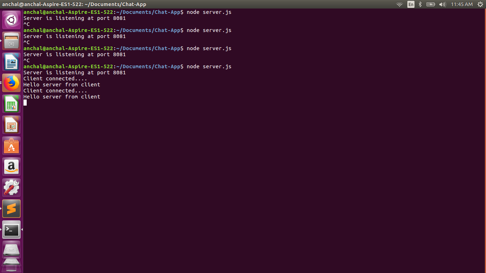
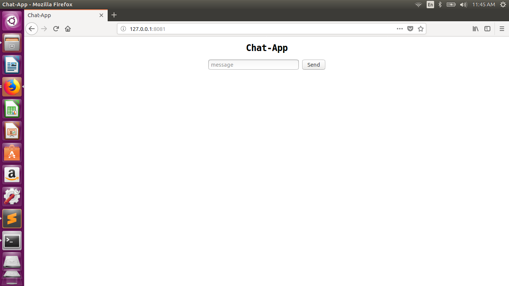

# Real-time-chat-app
<html>
<body>

Once Again started Nodejs:)

Hi! We are creating chat-app using framework like Nodejs and libraries like Socket.io and Express.Using Node.js we can write javascript for the server and Socket.io and Express can make use of websockets to push messages to user from server in real-time.

First step is to create directory structure

<li>|-public</li>
  <li>|-index.html</li>
  <li>|-style.css</li>
  <li>|-client.js</li>
<li>|-server.js</li>
<li>|-package.json</li>

dependencies:

<li>-> var http = require("http");</li>
<li>-> var app = require("express");</li>
<li>-> var mongoose = require("mongoose");</li>
<li>-> var io = require("socket.io");</li>

configure the static files folder

<li>-> app.use(express.static(__dirname +'/public'));</li>

In index.html file add your html.....

Now in server.js create http server at port 8081

<li>->server.listen(8081);</li>
<li>->console.log("Server is listening at port 8081");</li>

Now our task is to connect clients to server.

For this we use sockets 

In client.js we add following code:

<li>->var socket = io.connect('http://localhost:8081');</li>
<li>->socket.on('connect',function(data){

	socket.emit('join','Hello server from client');
->});</li>

In server.js add following code:

<li>->io.on('connection',function(client){

	console.log('Client connected....');
	client.on('join',function(data){
		console.log(data);
	});
->});</li>

 Uptill our app looks like 

</img>
</img>
</body>
</html>

